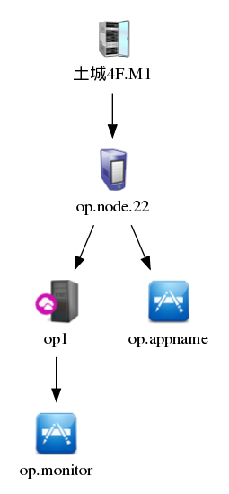

# iTop API wrapper

Secondary encapsulation of iTop API is easy to call

iData model using https://github.com/annProg/itop-extensions

## Parameter Description

| Parameters | Description |
| ---- | ---- |
|type |ip,app,server,url,domain,default,etc (iyou can define config['map'] in config.php to map the type and the corresponding iTop class) |
|value |Multiple values are separated by commas |
|rankdir |dot graphics direction, LR or TB，default TB |
|depth |relation depth, the default app is 1, ip, default,etc. are 3 |
|direction |Association direction, up (dependency), down (influence), both (dependency and influence), the default is down |
|show |The iTop class that controls the display of relation, comma-separated |
|hide |The iTop class that controls relation hiding, comma-separated |
|filter |Controls the type of objects displayed, comma-separated |

## Example

Called with the following parameters

```
public.php?type=ip&value=10.0.0.2&filter=Server&show=Server,Cluster,Rack,ApplicationSolution&direction=both&depth=2
```

Query the association relationship of the server whose `IP` is `10.0.0.2`, and objects only display the `Server` class, the relations class displays `Server, Cluster, Rack, ApplicationSolution&direction`, and also display the upstream and downstream associations of this server, associations The depth is only displayed at level 2, and the result is similar to the following 

```
{
  "relations": {
    "Server::2::op.node.22": [
      {
        "key": "Cluster::3::op1"
      },
      {
        "key": "ApplicationSolution::54::op.appname"
      }
    ],
    "Cluster::3::op1": [
      {
        "key": "ApplicationSolution::53::op.monitor"
      }
    ],
    "Rack::11::土城4F.M1": [
      {
        "key": "Server::2::op.node.22"
      }
    ]
  },
  "objects": {
    "Server::2": {
      "code": 0,
      "message": "",
      "class": "Server",
      "key": "2",
      "fields": {
        "id": "2",
        "friendlyname": "op.node.22"
      }
    }
  },
  "code": 0,
  "message": "Scope: 1; Related objects: Server= 1",
  "imgurl": "http://cmdb.cn/chart/api.php?cht=gv:dot&chl=digraph+G..."
}
```

The picture shows the following



## Deployment method recommendations

cmdbApi listens on local port 

```
server {
	listen      127.0.0.1:8090;
	access_log logs/cmdbapi.log main;
	root /opt/wwwroot/cmdb.xxx.cn/cmdbApi/web;

	include enable-php.conf;

	location / {
		index  index.html index.htm index.php;
	}

	location ~ /\.
	{
		deny all;
	}

}
```
cmdbApi画图依赖 [chart](https://github.com/annProg/chart)接口，此接口用于将dot源码转换为图片

```
server {
	listen      127.0.0.1:8091;
	access_log logs/cmdbchart.log main;
	root /opt/wwwroot/cmdb.xxx.cn/chart/;

	include enable-php.conf;

	location / {
		index  index.html index.htm index.php;
	}

	location ~ /\.
	{
		deny all;
	}

}
```
在cmdb配置文件里做反向代理

```
upstream graphviz-api {
	server 127.0.0.1:8091;
}

upstream cmdb-pubapi {
	server 127.0.0.1:8090;
}

server {
	listen      80;
	server_name  cmdb.xxx.cn;
	access_log logs/cmdb.xxx.cn.log main;
	root /opt/wwwroot/cmdb.xxx.cn/web;

	include enable-php.conf;

	location / {
		index  index.html index.htm index.php;
	}
	
	location /data/ {
		deny all;
	}
	
	location ^~ /api/ {
		proxy_pass http://cmdb-pubapi/;
		proxy_set_header     X-Forwarded-For $proxy_add_x_forwarded_for;
	}

	location ^~ /chart/ {
		proxy_pass http://graphviz-api/;
	}
	location ~ .*\.(gif|jpg|jpeg|png|bmp|swf)$
	{
		expires      30d;
	}

	location ~ .*\.(js|css)?$
	{
		expires      12h;
	}

	location ~ /\.
	{
		deny all;
	}

}
```
